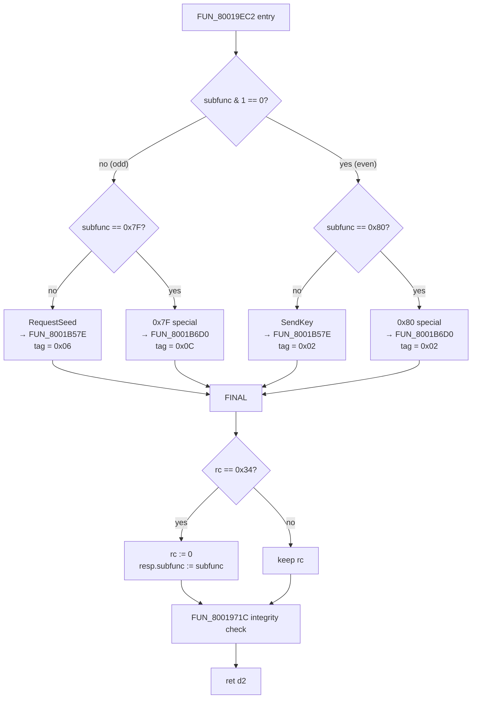

# `FUN_80019EC2` — UDS SecurityAccess Dispatcher (parity-first split)

> **Companion address note.** The alternative-sub-function handler was relocated
> from its original `0x8001B688` slot to `0x8001B6D0` because the new
> `FUN_8001B57E` body is 332 bytes (was 266) and now extends through
> `0x8001B6CA`. The two CALL instructions in this dispatcher therefore target
> `0x8001B6D0` rather than `0x8001B688`. The relocated routine is byte-for-byte
> the same code, only at a higher address.

## What this function does

This is the handler bound to UDS Service-ID `0x27` (SecurityAccess) in the main
service dispatch table at `0x8001BF48`. It is invoked once per UDS request that
addresses Service `0x27` and is responsible for routing the request into one of
four sub-paths based on the *sub-function* byte (`request[0x1B]`):

| Sub-function category | Where the payload lives    | Callee invoked   | Tag written |
|-----------------------|----------------------------|------------------|-------------|
| Odd RequestSeed       | Written to response buffer | `FUN_8001B57E`   | `0x06`      |
| Even SendKey          | Read from request buffer   | `FUN_8001B57E`   | `0x02`      |
| Special `0x7F`        | Reserved/supplier slot     | `FUN_8001B6D0`   | `0x0C`      |
| Special `0x80`        | Reserved/supplier slot     | `FUN_8001B6D0`   | `0x02`      |

A successful inner-call return code of `0x34` is translated to the outer return
value `0x00` and triggers `resp->subfunc = subfunc`. Every path ends with a tail
call to `FUN_8001971C` (the post-attempt integrity validator).

## Why the rewrite

The original methodology was a **linear if/else chain** that tested the four
cases in order: `0x7F`, then `0x80`, then `(subfunc & 1)`, then else. The
clean-room rewrite uses a **parity-first decision tree** that pivots on a single
bit-test (`subfunc & 1`) first, then identifies the special value inside each
parity branch. The two structures produce bit-identical output for every input
but inspect the input in a different order, exercising different basic-block
boundaries in the binary.

## Algorithm (new methodology) — pseudo-code

```c
int uds_security_access_dispatch(uds_msg_t *req, uds_msg_t *resp)
{
    uint8_t subfunc = req->subfunc;          // req + 0x1B
    uint8_t tag;
    int     rc;

    if (subfunc & 1) {                       // ----- ODD parity -----
        if (subfunc == 0x7F) {               // odd special
            rc  = FUN_8001b6d0(&resp->payload, 0x7F);
            resp->status_7f = (int8_t) rc;
            tag = 0x0C;
        } else {                             // RequestSeed
            rc  = uds_security_access_handler(
                      &resp->payload, subfunc, req->payload[0]);
            resp->status_requestseed = (int8_t) rc;
            tag = 0x06;
        }
    } else {                                 // ----- EVEN parity -----
        if (subfunc == 0x80) {               // even special
            rc  = FUN_8001b6d0(&req->payload, 0x80);
        } else {                             // SendKey
            rc  = uds_security_access_handler(&req->payload, subfunc, 0);
        }
        resp->status_lo = (int8_t) rc;
        tag = 0x02;
    }

    resp->response_tag = tag;                // resp + 0x19
    if (rc == 0x34) {
        rc = 0;
        resp->subfunc = subfunc;             // echo
    }
    check_security_state_integrity();        // FUN_8001971C — tail
    return rc;
}
```

## Stages

### 1. Argument materialisation

| Operation                                  | TriCore mnemonic                     |
|--------------------------------------------|--------------------------------------|
| Save request pointer in A2                 | `mov.aa a2, a4`                      |
| Anchor sub-function-byte pointer in A3     | `lea a3, [a4]0x18`                   |
| Anchor response-status base in A15         | `lea a15, [a5]0x18`                  |
| Load sub-function byte into D15            | `ld.bu d15, [a3]#0x3`                |
| Zero-extend into D9 (the persistent copy)  | `extr.u d9, d15, #0x0, #0x8`         |

After these five instructions, the parity-test register (D15) and the
sub-function-echo register (D9) both hold the request byte, and the two pointer
anchors required by the rest of the function (`a2` for request payload,
`a15+offset` for response status fields) are in place.

### 2. Parity gate

A single bit-test on D15 splits the control flow.

| Operation                                  | TriCore mnemonic                     |
|--------------------------------------------|--------------------------------------|
| If `subfunc & 1 == 0`, jump to EVEN branch | `jz.t d15, #0x0, LBL_EVEN_PATH`      |

### 3. Odd branch

```text
mov  d4, #0x7F
jeq  d9, d4, LBL_ODD_SPECIAL   ; subfunc == 0x7F → special handler
; --- RequestSeed common path ---
mov  d4, d9                     ; param_2 = subfunc
lea  a4, [a5]0x1c               ; resp.payload
ld.bu d5, [a3]0x4               ; session_byte = req[0x1C]
call 0x8001b57e
mov  d8, d2                     ; save rc
st.b [a15]#0x8, d2              ; resp[0x20] = (int8_t) rc
mov  d15, #0x06                 ; tag
j    LBL_FINAL

LBL_ODD_SPECIAL:
lea  a4, [a5]0x1c
call 0x8001b688                 ; (d4 still 0x7F)
mov  d8, d2
st.b [a15]#0xe, d2              ; resp[0x26]
mov  d15, #0x0c                 ; tag
j    LBL_FINAL
```

### 4. Even branch

```text
LBL_EVEN_PATH:
mov  d4, #0x80
jeq  d9, d4, LBL_EVEN_SPECIAL   ; subfunc == 0x80 → special handler
; --- SendKey common path ---
mov  d4, d9                     ; subfunc
lea  a4, [a2]0x1c               ; req.payload
mov  d5, #0x0                   ; session_byte = 0
call 0x8001b57e
j    LBL_EVEN_END

LBL_EVEN_SPECIAL:
lea  a4, [a2]0x1c
call 0x8001b688                 ; (d4 still 0x80)

LBL_EVEN_END:
mov  d8, d2                     ; save rc
st.b [a15]#0x4, d2              ; resp[0x1C]
mov  d15, #0x02                 ; tag
```

### 5. Common epilogue

```text
LBL_FINAL:
st.b [a15]#0x1, d15             ; resp[0x19] = response_tag
mov  d0, #0x34
jne  d8, d0, LBL_SKIP           ; if rc != 0x34, fall through
mov  d8, #0x0                   ; success: rc → 0
st.b [a15]#0x3, d9              ; echo subfunc into resp[0x1B]
LBL_SKIP:
call 0x8001971c                 ; integrity validator (tail-ish)
mov  d2, d8
ret
```

## State and side-effects

| State touched                  | When / how                                       |
|--------------------------------|--------------------------------------------------|
| `resp[0x19]` response tag      | Always, set to {0x02, 0x06, 0x0C} depending on path |
| `resp[0x1B]` subfunc echo      | Only when inner callee returned 0x34             |
| `resp[0x1C..0x1F]` payload     | Touched on RequestSeed (odd) and 0x80 paths      |
| `resp[0x20]` requestseed status | Only on the RequestSeed path                    |
| `resp[0x26]` 0x7F status        | Only on the 0x7F path                            |
| `FUN_8001971C`                 | Always called once at the end                    |

The function does not mutate the request buffer.

## Call-graph (Mermaid)



## Equivalence note

For every input `subfunc ∈ [0, 0xFF]` the new dispatcher takes the *same*
internal-rc path and writes the *same* output fields as the original linear
if/else chain. The only difference is the order in which the comparisons are
evaluated: the original tests both special values before parity; the rewrite
tests parity first then the matching special value. The output side-effects are
deterministic functions of (subfunc, rc), and both implementations agree on
that function.

## Code map (offsets within the 124-byte function body)

| Offset | Label              | Purpose                            |
|--------|--------------------|------------------------------------|
| `0x00` | (entry)            | argument materialisation           |
| `0x14` | (parity gate)      | `jz.t d15, #0, LBL_EVEN_PATH`      |
| `0x32` | `LBL_ODD_SPECIAL`  | 0x7F path                          |
| `0x42` | `LBL_EVEN_PATH`    | even-parity branch root            |
| `0x58` | `LBL_EVEN_SPECIAL` | 0x80 path                          |
| `0x60` | `LBL_EVEN_END`     | even-branch convergence            |
| `0x66` | `LBL_FINAL`        | tag store + success normalisation  |
| `0x74` | `LBL_SKIP`         | success-rewrite skip target        |
