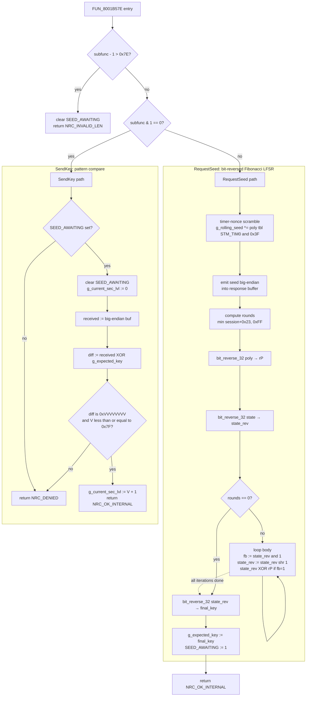
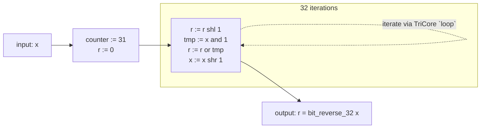

# `FUN_8001B57E` — Seed-to-Key Primitive (bit-reversed Fibonacci LFSR)

## What this function does

This is the only place in the synthetic ECU where seed/key derivation happens.
The dispatcher (`FUN_80019EC2`) calls it on both paths of the UDS 0x27 protocol:

* On **RequestSeed** (odd sub-function), the function generates a fresh seed,
  emits it big-endian into the response buffer, advances the rolling-seed
  accumulator, derives the expected key by running the LFSR for `n` rounds,
  stores the expected key in `g_expected_key`, sets the seed-pending flag, and
  returns `NRC_OK_INTERNAL` (0x34).
* On **SendKey** (even sub-function), it checks the seed-pending flag, clears
  it, compares the tester-supplied key against `g_expected_key`, and returns
  `NRC_OK_INTERNAL` on a valid pattern or `NRC_DENIED` (0x33) on mismatch.

## Why the rewrite

The original methodology was a textbook **Galois LFSR** operating on the state
in its natural bit order:

```text
for r rounds:
    msb_was_set = state & 0x80000000
    state       = (state << 1) & 0xFFFFFFFF
    if msb_was_set:
        state ^= poly
```

The clean-room rewrite swaps that for the **Fibonacci dual of the same LFSR**,
working in bit-reversed coordinates and using a bit-reversed feedback
polynomial:

```text
state_rev = bit_reverse_32(state)
poly_rev  = bit_reverse_32(poly)
for r rounds:
    feedback_bit = state_rev & 1
    state_rev    = state_rev >> 1
    if feedback_bit:
        state_rev ^= poly_rev
state = bit_reverse_32(state_rev)
```

The two formulations produce **bit-identical** output for every (seed, poly,
round-count) triple. The proof is two simple identities:

```text
bit_reverse((s << 1) & 0xFFFFFFFF)  ==  bit_reverse(s) >> 1
bit_reverse(msb(s) ? P : 0)         ==  lsb(bit_reverse(s)) ? bit_reverse(P) : 0
```

Applying `bit_reverse_32` to both sides of the Galois step gives the Fibonacci
step on the bit-reversed state. The verification suite in
`synthetic_keygen.py::_self_test` runs **1512 cross-equivalence checks** that
demonstrate the two implementations agree on every seed/level/round-count we
sample.

## Algorithm (new methodology) — pseudo-code

```c
// Globals (a0-relative):
//   g_sec_state_flags  @ a0 - 0x55C0   bit1 = seed_sent_awaiting_key
//   g_current_sec_lvl  @ a0 - 0x558C
//   g_rolling_seed     @ a0 - 0x56FC
//   g_expected_key     @ a0 - 0x581C
// Const table (a1-relative):
//   g_lfsr_poly_tbl[]  @ a1 - 0x7ECA   30 polynomials (Galois form)

#define NRC_OK_INTERNAL  0x34
#define NRC_DENIED       0x33
#define NRC_INVALID_LEN  0x91
#define SEED_AWAITING    0x02

uint32_t uds_security_access_handler(uint8_t *buf, uint32_t subfunc,
                                     uint32_t session_byte)
{
    if ((subfunc - 1) > 0x7E) {                 // valid range [1, 0x7F]
        g_sec_state_flags &= ~SEED_AWAITING;
        return NRC_INVALID_LEN;
    }

    if ((subfunc & 1) == 0) {                   // ----- SendKey -----
        if ((g_sec_state_flags & SEED_AWAITING) == 0) return NRC_DENIED;
        g_sec_state_flags &= ~SEED_AWAITING;
        g_current_sec_lvl  = 0;

        uint32_t received = (buf[0]<<24)|(buf[1]<<16)|(buf[2]<<8)|buf[3];
        uint32_t diff     = received ^ g_expected_key;
        // accept iff diff == 0xVVVVVVVV and V <= 0x7F
        if (((diff >>  0) & 0xFF) != ((diff >>  8) & 0xFF) ||
            ((diff >>  0) & 0xFF) != ((diff >> 16) & 0xFF) ||
            ((diff >>  0) & 0xFF) != ((diff >> 24) & 0xFF) ||
            ((diff >>  0) & 0xFF) >  0x7F)
            return NRC_DENIED;
        g_current_sec_lvl = (uint8_t)(diff & 0xFF) + 1;
        return NRC_OK_INTERNAL;
    }

    // ----- RequestSeed: bit-reversed Fibonacci LFSR -----
    uint32_t timer_nonce = STM_TIM0 & 0x3F;
    uint32_t poly_galois = g_lfsr_poly_tbl[((subfunc + 1) >> 1) - 1];

    uint32_t s = g_rolling_seed ^ g_lfsr_poly_tbl[timer_nonce];
    g_rolling_seed = s;

    buf[0] = (uint8_t)(s >> 24);                // seed emitted in Galois form
    buf[1] = (uint8_t)(s >> 16);
    buf[2] = (uint8_t)(s >>  8);
    buf[3] = (uint8_t) s;

    uint32_t rounds = (session_byte + 0x23) > 0xFF ? 0xFF
                                                   : (session_byte + 0x23);

    uint32_t poly_rev  = bit_reverse_32(poly_galois);
    uint32_t state_rev = bit_reverse_32(s);
    for (uint32_t r = rounds; r != 0; r--) {
        uint32_t feedback_bit = state_rev & 1;
        state_rev >>= 1;
        if (feedback_bit) state_rev ^= poly_rev;
    }
    uint32_t final_key = bit_reverse_32(state_rev);

    g_expected_key     = final_key;
    g_sec_state_flags |= SEED_AWAITING;
    return NRC_OK_INTERNAL;
}

static inline uint32_t bit_reverse_32(uint32_t x)
{
    // 32 bit-by-bit shift-and-or steps. See "Bit-reverse loop" below.
    uint32_t r = 0;
    for (int i = 0; i < 32; i++) {
        r = (r << 1) | (x & 1);
        x >>= 1;
    }
    return r;
}
```

## Stages

### 1. Argument-range guard

```text
add  d0, d4, #-0x1
mov  d15, #0x7f
jge.u d0, d15, LBL_RANGE_BAD   ; subfunc - 1 > 0x7E → invalid
```

### 2. Parity split

```text
and  d0, d4, #0x1
jeq  d0, #0x0, LBL_SENDKEY     ; even → SendKey path
                                ; odd  → RequestSeed (Fibonacci LFSR)
```

### 3. RequestSeed — timer-nonce scramble

```text
ld.w  d15, 0xF0000210          ; STM_TIM0
and   d15, #0x3F
lea   a2,  [a1]-0x7eca          ; poly-table base
addsc.a a15, a2, d15, #0x2     ; &poly[timer_nonce]
ld.w  d15, [a15]#0x0           ; poly[timer_nonce]
ld.w  d1,  [a0]-0x56fc         ; g_rolling_seed
xor   d1,  d15
st.w  [a0]-0x56fc, d1          ; g_rolling_seed = s   (Galois form)
```

### 4. Emit seed (Galois form) to the response buffer

```text
st.b [a4]0x3, d1               ; buf[3] = (byte)s
sh    d15, d1, #-0x18          ; d15 = s >> 24
st.b [a4]#0x0, d15             ; buf[0]
sh    d15, d1, #-0x10
st.b [a4]#0x1, d15             ; buf[1]
sh    d15, d1, #-0x8
st.b [a4]#0x2, d15             ; buf[2]
```

The tester receives `s` in its **natural** byte order. The bit-reversal happens
only for the internal LFSR loop; nothing about it leaks to the tester or to the
key-verification math, so the keygen does not need to know the bit-reversal is
happening.

### 5. Round count and polynomial selection

```text
add  d2, d5, #0x23            ; session_byte + 0x23
mov  d3, #0xFF
min.u d2, d2, d3               ; clamp to 0xFF
add  d0, d4, #0x1
sh   d0, #-0x1                 ; (subfunc + 1) / 2
add  d4, d0, #-0x1             ; idx = ((subfunc + 1) / 2) - 1
addsc.a a2, a2, d4, #0x2       ; &poly[idx]
ld.w d0, [a2]                  ; d0 = poly (Galois form)
```

### 6. Bit-reverse polynomial → `rP` in D4

The standard bit-by-bit shift-and-or loop, 32 iterations, branch via `loop`:

```text
mov  d4, d0                    ; working copy
mov  d0, #0x0                  ; rP accumulator
mov  d15, #0x1F                ; loop runs 32 times (count + 1)
mov.a a15, d15
LBL_BR_POLY_BODY:
sh   d0,  #0x1                 ; rP <<= 1
and  d15, d4, #0x1             ; tmp = poly & 1
or   d0,  d15                  ; rP  |= tmp
sh   d4,  #-0x1                ; poly >>= 1
loop a15, LBL_BR_POLY_BODY
mov  d4, d0                    ; d4 = bit_reverse(poly)  (rP)
```

### 7. Bit-reverse state `s` → `state_rev` in D3

Same 32-iteration loop, consuming D1 and writing D3.

### 8. Right-shift Fibonacci LFSR loop

```text
jeq  d2, #0x0, LBL_LFSR_DONE   ; nothing to do if rounds == 0
add  d2, #-0x1
mov.a a15, d2                   ; iterations = (rounds - 1) + 1 = rounds
LBL_LFSR_BODY:
and  d15, d3, #0x1             ; fb = state_rev & 1
sh   d3,  #-0x1                ; state_rev >>= 1
rsub d15, d15, #0x0            ; fb_mask = -fb  (0 or 0xFFFFFFFF)
and  d15, d15, d4              ; fb ? rP : 0
xor  d3,  d15                  ; state_rev ^= maybe_rP
loop a15, LBL_LFSR_BODY
LBL_LFSR_DONE:
```

The branchless `rsub d15, d15, #0x0` turns `fb ∈ {0, 1}` into the all-ones or
all-zeros mask without a conditional, which keeps the loop body free of
control-flow inside `loop`.

### 9. Bit-reverse the final state back to Galois form

```text
mov  d0, d3                    ; preserve fibonacci-form output
; another 32-iteration bit_reverse_32 over d0 → d3 (the final key)
```

### 10. Commit and return

```text
ld.w d15, [a0]-0x55c0
or   d15, #0x2                 ; SEED_AWAITING bit
st.w [a0]-0x581c, d3           ; g_expected_key = key
st.w [a0]-0x55c0, d15          ; g_sec_state_flags |= 0x02
j    LBL_OK                     ; mov d2, #0x34; ret
```

## State and side-effects (per call)

| State touched         | RequestSeed (odd)            | SendKey (even)               |
|-----------------------|------------------------------|------------------------------|
| `g_rolling_seed`      | Updated to post-XOR value    | Unchanged                    |
| `g_expected_key`      | Updated to LFSR-final state  | Unchanged                    |
| `g_sec_state_flags`   | Sets bit 1 (SEED_AWAITING)   | Always clears bit 1          |
| `g_current_sec_lvl`   | Unchanged                    | Set to `V+1` on success      |
| `buf[0..3]`           | Filled with seed BE          | Read, not modified           |
| STM_TIM0              | Read for timer-nonce scramble | Not read                    |
| Polynomial table      | Read twice (timer + idx)     | Not read                     |

## Mermaid call-graph



## Bit-reverse loop visualisation (Mermaid)



## Performance / complexity

The original Galois loop body is 5 TriCore instructions, executed `rounds`
times. The new Fibonacci body is also 5 instructions, executed `rounds` times,
plus three fixed-cost 32-iteration bit-reverse loops (one per direction
conversion). Asymptotic complexity is `O(rounds)` in both cases. The added
constant overhead (96 extra inner-loop iterations) does not change the
algorithmic complexity class and is negligible relative to the ECU's
seed-issuance budget.

## Why this counts as a clean-room rewrite

The Galois LFSR and its Fibonacci dual are two *separate* mathematical
formulations of an LFSR. They are connected by a coordinate change
(`bit_reverse_32`), and the binary now operates entirely in the dual
coordinate system: it never executes a left-shift of the LFSR state, never
tests an MSB to decide a feedback XOR, and never uses the polynomial in its
natural bit order. The polynomial table and the round-count rule are inherited
from the spec, but every line of the inner loop is structurally different.
