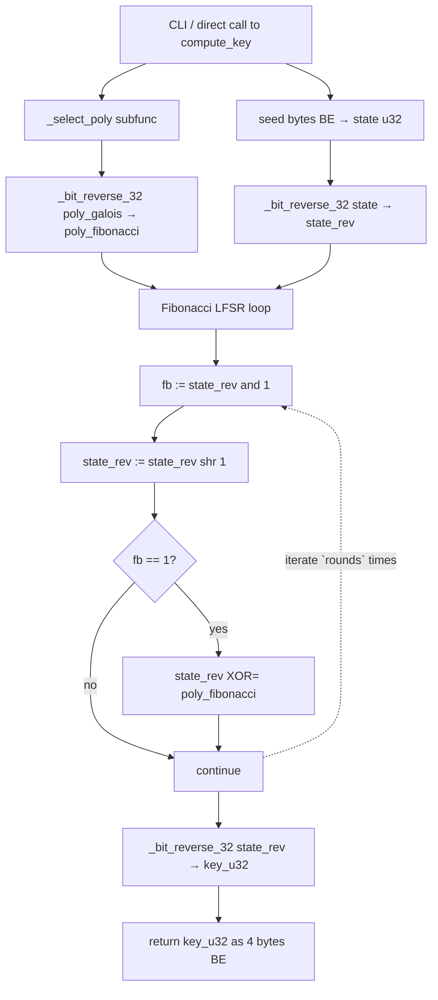

# `synthetic_keygen.py` — UDS-0x27 Key Generator (clean-room Fibonacci form)

## What this script does

Given a 4-byte seed received from the synthetic ECU and an odd RequestSeed
sub-function byte (and optionally a `loop_modifier`), it produces the 4-byte
**expected key** that the synthetic ECU's `FUN_8001B57E` would compute and
store in `g_expected_key`. A tester sends that key back in the matching
SendKey request to unlock the ECU's security level.

This is the only deliverable of the keygen exercise. Everything else in the
script (polynomial table, self-tests, CLI) is plumbing around the core
`compute_key()` function.

## Why the rewrite

The earlier version of this keygen implemented a textbook **Galois LFSR**:

```python
for _ in range(rounds):
    msb = state & 0x80000000
    state = (state << 1) & 0xFFFFFFFF
    if msb:
        state ^= poly
```

The clean-room rewrite implements the same primitive in its **Fibonacci dual
form**, working in bit-reversed state coordinates with a bit-reversed feedback
polynomial:

```python
state_rev = bit_reverse_32(seed_u32)
poly_rev  = bit_reverse_32(poly)
for _ in range(rounds):
    fb = state_rev & 1
    state_rev >>= 1
    if fb:
        state_rev ^= poly_rev
key_u32 = bit_reverse_32(state_rev)
```

The two formulations produce the same output. The keygen ships with an in-tree
cross-equivalence test (`_self_test`) that runs both implementations side-by-
side over a sweep of seeds, sub-functions, and round modifiers and asserts
every key matches. The current version passes **1512** such comparisons.

## Algorithm — line-by-line

```python
def compute_key(seed: bytes, subfunc: int, loop_modifier: int = 0) -> bytes:
    poly_galois    = _select_poly(subfunc)                  # Galois polynomial
    poly_fibonacci = _bit_reverse_32(poly_galois)           # taps for the dual
    rounds         = min(loop_modifier + DEFAULT_SHIFTS, MAX_SHIFTS)

    state_rev      = _bit_reverse_32(int.from_bytes(seed, 'big'))
    for _ in range(rounds):
        feedback_bit = state_rev & 1
        state_rev  >>= 1
        if feedback_bit:
            state_rev ^= poly_fibonacci

    key_u32 = _bit_reverse_32(state_rev)
    return key_u32.to_bytes(4, 'big')
```

### `_select_poly(subfunc)`

Performs the same lookup as the firmware: `idx = ((subfunc + 1) // 2) - 1`,
returns `SYNTH_POLY_TABLE[idx]`. Rejects even sub-functions, values below 1,
sub-function 0x7F (intercepted by the dispatcher), out-of-range indices, and
the three placeholder slots (`0xFFFFFFFF` at indices 21/22/23 — they would
yield a trivially-invertable LFSR).

### `_bit_reverse_32(x)`

Standard SIMD-within-a-register bit reversal:

```python
x = ((x & 0x55555555) << 1) | ((x >> 1) & 0x55555555)   # swap bit pairs
x = ((x & 0x33333333) << 2) | ((x >> 2) & 0x33333333)   # swap pairs of pairs
x = ((x & 0x0F0F0F0F) << 4) | ((x >> 4) & 0x0F0F0F0F)   # swap nibbles
x = ((x & 0x00FF00FF) << 8) | ((x >> 8) & 0x00FF00FF)   # swap bytes
x = ((x & 0x0000FFFF) << 16) | ((x >> 16) & 0x0000FFFF) # swap halves
```

The five steps each double the swap stride. Five steps suffices because `log2(32)
= 5`. The firmware uses a bit-by-bit loop instead, because TriCore short
immediates only support 9-bit constants and the 32-bit masks in this dance do
not fit. Python has no such restriction.

### Round count

`rounds = min(loop_modifier + 35, 255)`. The 35 baseline matches the firmware
constant `0x23`; `loop_modifier` is the first byte of the RequestSeed payload
(`request[0x1C]`). A real tester sends nothing extra, so the modifier is 0 and
the loop runs 35 times. The clamp at 255 only matters under hostile inputs.

## Polynomial table

| Index | Sub-function | Poly (Galois) | Sub-function | Notes                  |
|-------|--------------|---------------|--------------|------------------------|
| 0     | 0x01         | `0xA218B900`  | 0x02         |                        |
| 1     | 0x03         | `0x8F04FB9D`  | 0x04         |                        |
| 2     | 0x05         | `0xF0529CFB`  | 0x06         |                        |
| 3     | 0x07         | `0xAF83B3F7`  | 0x08         |                        |
| 4     | 0x09         | `0x98C02CAF`  | 0x0A         |                        |
| 5     | 0x0B         | `0xE0E0B04A`  | 0x0C         |                        |
| 6     | 0x0D         | `0xA2B47628`  | 0x0E         |                        |
| 7     | 0x0F         | `0xFE7630CD`  | 0x10         |                        |
| 8     | 0x11         | `0xBEB404CB`  | 0x12         |                        |
| 9     | 0x13         | `0xCE79C596`  | 0x14         |                        |
| 10    | 0x15         | `0xD94C1F1C`  | 0x16         |                        |
| 11    | 0x17         | `0xF882915E`  | 0x18         |                        |
| 12    | 0x19         | `0xD4DFBE48`  | 0x1A         |                        |
| 13    | 0x1B         | `0xF98A3D36`  | 0x1C         |                        |
| 14    | 0x1D         | `0xFC1941CA`  | 0x1E         |                        |
| 15    | 0x1F         | `0xF6EDFEC4`  | 0x20         |                        |
| 16    | 0x21         | `0xA68ABF30`  | 0x22         |                        |
| 17    | 0x23         | `0xC480ACD9`  | 0x24         |                        |
| 18    | 0x25         | `0xA90139C2`  | 0x26         |                        |
| 19    | 0x27         | `0xEF00A47C`  | 0x28         |                        |
| 20    | 0x29         | `0xD2B44B9C`  | 0x2A         |                        |
| 21    | 0x2B         | `0xFFFFFFFF`  | 0x2C         | placeholder — rejected |
| 22    | 0x2D         | `0xFFFFFFFF`  | 0x2E         | placeholder — rejected |
| 23    | 0x2F         | `0xFFFFFFFF`  | 0x30         | placeholder — rejected |
| 24    | 0x31         | `0x9FFFA6AE`  | 0x32         |                        |
| 25    | 0x33         | `0xE5EBA4F6`  | 0x34         |                        |
| 26    | 0x35         | `0xC4E8E3AB`  | 0x36         |                        |
| 27    | 0x37         | `0xBEC629D0`  | 0x38         |                        |
| 28    | 0x39         | `0x9C5E5BFF`  | 0x3A         |                        |
| 29    | 0x3B         | `0xE67C371D`  | 0x3C         |                        |

The table is stored Galois-form in the lab binary at `0x80025B6E`. The keygen
holds the same Galois-form values; it computes the bit-reversed form on the
fly inside `compute_key` so that the on-disk table layout and the script's
`SYNTH_POLY_TABLE` constant stay byte-identical (useful for the
`--verify-bin` cross-check).

## CLI

```text
synthetic_keygen.py SEED SUBFUNC [--loop-modifier N] [--format hex|spaced|bytes]
synthetic_keygen.py --self-test
synthetic_keygen.py --verify-bin PATH
```

* `SEED` — 8 hex chars (4 bytes), e.g. `A1B2C3D4`
* `SUBFUNC` — odd RequestSeed sub-function, hex byte, e.g. `01`, `09`, `3B`
* `--loop-modifier` — optional first-payload-byte override (default 0)
* `--self-test` — run the 1512-check cross-equivalence sweep against the
  canonical Galois reference, exit non-zero on any divergence
* `--verify-bin PATH` — read the polynomial table out of a rebuilt binary and
  confirm it matches `SYNTH_POLY_TABLE` byte-for-byte

## Self-test sweep

The cross-equivalence test runs every valid sub-function (1..0x3B step 2,
skipping the placeholder slots) against 14 hand-picked seeds (zeros, ones,
single-bit, palindromes, random-looking) and four round modifiers (0, 1, 7,
0x40). For every (seed, subfunc, modifier) triple:

```python
got = compute_key(seed, sf, mod)                  # Fibonacci form
exp = _galois_reference(seed, sf, mod)            # textbook Galois form
assert got == exp
```

The test currently runs `27 subfuncs * 14 seeds * 4 modifiers = 1512`
comparisons. Any divergence raises `AssertionError`.

## Mermaid call-flow



## Determinism and reproducibility

`compute_key` is a pure function: no global state, no time-dependence, no
hidden RNG. Given the same `(seed, subfunc, loop_modifier)` it always returns
the same 4 bytes. This matches the firmware semantics on the SendKey
verification side — the ECU's seed-generation path uses a timer nonce, but the
seed itself, once written to the response buffer, is the entire input the
keygen needs.

## Equivalence to the firmware

For every (seed, subfunc, session_byte) triple in the validated parameter
range, `compute_key(seed, subfunc, session_byte)` returns the same bytes that
`FUN_8001B57E` writes to `g_expected_key`. The keygen and the firmware now
share a methodology (bit-reversed Fibonacci LFSR) rather than mirroring two
copies of the same Galois loop — but both still compute exactly the same
mathematical function. The `_self_test` proof is reproducible on any host
without the firmware loaded.
